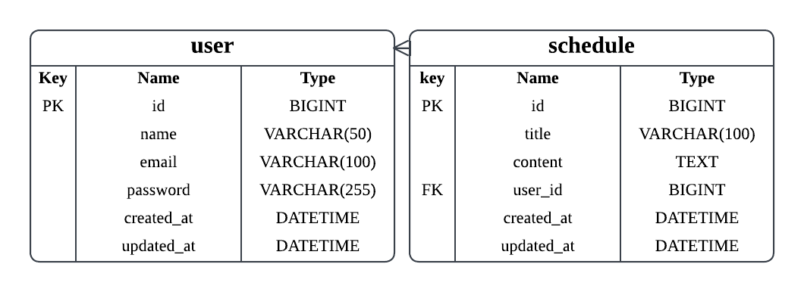

# API 명세

---

# Lv1. Schedule API

## 1. 일정 생성

| 항목 | 내용 |
|------|------|
| URL | `POST /schedules` |
| 설명 | 새로운 일정을 생성합니다. |
| Request Body | `name`, `title`, `content` |
| Response | `201 Created` |
| Response Body | 생성된 일정 정보 |
| Error | `400 Bad Request` |
| 비고 | 작성일(createdAt), 수정일(updatedAt)은 JPA Auditing을 통해 자동 생성됩니다. |

---

## 2. 일정 전체 조회

| 항목 | 내용 |
|------|------|
| URL | `GET /schedules` |
| 설명 | 전체 일정을 조회합니다. |
| Query Parameter | 없음 |
| Response | `200 OK` |
| Response Body | 일정 목록(List) |
| Error | 없음 |

---

## 3. 일정 단건 조회

| 항목 | 내용 |
|------|------|
| URL | `GET /schedules/{id}` |
| 설명 | 선택한 일정을 조회합니다. |
| Path Variable | `id(Long)` |
| Response | `200 OK` |
| Response Body | 일정 정보 |
| Error | `404 Not Found` |

---

## 4. 일정 수정

| 항목 | 내용 |
|------|------|
| URL | `PUT /schedules/{id}` |
| 설명 | 선택한 일정을 수정합니다. |
| Path Variable | `id(Long)` |
| Request Body | `title`, `content` |
| Response | `200 OK` |
| Response Body | 수정된 일정 정보 |
| Error | `404 Not Found` |

---

## 5. 일정 삭제

| 항목 | 내용 |
|------|------|
| URL | `DELETE /schedules/{id}` |
| 설명 | 선택한 일정을 삭제합니다. |
| Path Variable | `id(Long)` |
| Response | `204 No Content` |
| Error | `404 Not Found` |

---

# Lv2. User API

## 1. 유저 생성

| 항목 | 내용 |
|------|------|
| URL | `POST /users` |
| 설명 | 새로운 유저를 생성합니다. |
| Request Body | `name`, `email` |
| Response | `201 Created` |
| Response Body | 생성된 유저 정보 |
| Error | `400 Bad Request` |
| 제약사항 | 이메일은 중복될 수 없습니다. |

---

## 2. 유저 전체 조회

| 항목 | 내용 |
|------|------|
| URL | `GET /users` |
| 설명 | 전체 유저를 조회합니다. |
| Query Parameter | 없음 |
| Response | `200 OK` |
| Response Body | 유저 목록(List) |
| Error | 없음 |

---

## 3. 유저 단건 조회

| 항목 | 내용 |
|------|------|
| URL | `GET /users/{id}` |
| 설명 | 선택한 유저를 조회합니다. |
| Path Variable | `id(Long)` |
| Response | `200 OK` |
| Response Body | 유저 정보 |
| Error | `404 Not Found` |

---

## 4. 유저 수정

| 항목 | 내용 |
|------|------|
| URL | `PUT /users/{id}` |
| 설명 | 유저 정보를 수정합니다. |
| Path Variable | `id(Long)` |
| Request Body | `name`, `email` |
| Response | `200 OK` |
| Response Body | 수정된 유저 정보 |
| Error | `404 Not Found` |

---

## 5. 유저 삭제

| 항목 | 내용 |
|------|------|
| URL | `DELETE /users/{id}` |
| 설명 | 유저를 삭제합니다. |
| Path Variable | `id(Long)` |
| Response | `204 No Content` |
| Error | `404 Not Found` |

---

# Lv3. 회원가입 API

## 1. 회원가입

| 항목 | 내용 |
|------|------|
| URL | `POST /users/signup` |
| 설명 | 비밀번호를 포함하여 회원가입을 진행합니다. |
| Request Body | `name`, `email`, `password` |
| Response | `201 Created` |
| Response Body | 생성된 회원 정보 |
| Error | `400 Bad Request` |
| 제약사항 | 비밀번호는 8자 이상이어야 합니다. |

---

# Lv4. 로그인 API

## 1. 로그인

| 항목 | 내용 |
|------|------|
| URL | `POST /login` |
| 설명 | 이메일과 비밀번호를 이용하여 로그인합니다. |
| Request Body | `email`, `password` |
| Response | `200 OK` |
| Response Body | 로그인 성공 |
| Error | `401 Unauthorized` |
| 비고 | Cookie / Session 기반 인증을 사용합니다. |

---

## 2. 로그아웃

| 항목 | 내용 |
|------|------|
| URL | `POST /logout` |
| 설명 | 현재 로그인한 사용자의 세션을 종료합니다. |
| Response | `200 OK` |
| Response Body | 로그아웃 성공 |
| 비고 | Session을 삭제합니다. |

---

# ERD
